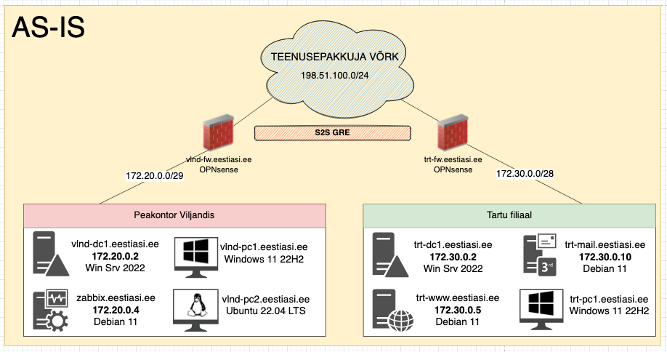
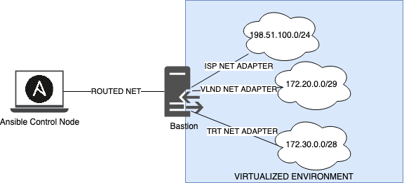

# Noor Meister 2023
## Introduction
This repository contains playbooks to get NM2023 "AS IS" topology up and running in lab environment. The same methods and playbooks are used to deploy the actual gamenet.




# Ansible
There won't be step-by-step guide how to install Ansible on your control node. Offical documentation can be referenced at https://docs.ansible.com/ansible/latest/installation_guide/intro_installation.html. Ansible version 2.14 was used while writing these playbooks.

## Structure

Playbooks naming convention

| Name | Function |
| -- | -- |
| ea-* | Eesti Asi AS environment |
| template-* | Template machines |
| vmware-* | VMware vCenter templates |

Networks
| Network | CIDR | Domain |
| -- | -- | -- |
| Viljandi | 172.20.0.0/29 | eestiasi.ee |
| Tartu | 172.30.0.0/28 | eestiasi.ee |
| ISP | 198.51.100.0/24 | nm23.ee |

Parameters that needs to be modified according to your environment
* `groups_vars/all.yml` the `ssh.master_key` should be updated with your public key
* `groups_vars/all.yml` update the subnet parameters according to your environment incase these won't work for you
* `groups_vars/bastion.yml` update the `bastion.key` incase bastion is used, otherwise `ansible_ssh_common_args` can be commented out
* `groups_vars/templates.yml` update the vmware parameters incase VMware vCenter is used
* copy `.creds-example.yml` to `.creds` incase VMware vCenter is used
* update `ansible.cfg` user and key parameters according to your setup

The deployment is done through jump host since the ISP, VLND and TRT subnets are not reachable for Ansible Control Node in our environment. We have one jump host for each competitor. In case these subnets are accessible for your Ansible Control Node the bastion parts can be skipped.



## Templates

There are more or less three types of templates in this environment - Windows, Linux and OPNsense. The template machines are used as reference machines while building the "AS IS" topology. In other words we build template machines to clone them afterwards according to network topology.

It is expected to have internet connectivity while configuring the template virtual machines. Template virtual machines don't have to follow the IP addressing plan according to "AS IS" network topology.

### OPNsense

Install the OPNsense router by logging in with username `installer` and password `opnsense` after booting from ISO. Go through installation wizard and after successful installation log-in to your OPNsense console and launch the shell with option 8.

Create the new administrative user for ansible as set in `ansible.cfg`

``` bash
root@OPNsense:~ # adduser
Username: ansible
Full name:
UID (Leave empty for defalut):
Login group [ansible]:
Login group is ansible. Invite ansible into other groups? []: wheel
Login class [default]:
Shell (csh sh tcsh opnsense-installer opensense-shell nologin) [sh]: csh
Home directory [/home/ansible]:
Home directory permissions (Leave empty for default):
Use Password-based authentication? [yes]:
Use an empty password? [no]: 
Use a random password? [no]:
Enter password:
Enter password again:
Lock out the account after creation: [no]:
OK? (yes/no): yes
Add another user? (yes/no): no
```

Modify the sudoers file and allow ansible to become sudoer without entering the password
``` bash
root@OPNsense:~ # visudo
...
## Add this line to the end of the file
ansible    ALL=(ALL:ALL)    NOPASSWD: ALL
...
```

Add the SSH public key to ansible user. This should be equvialent to `groups_vars/all.yml` value of `ssh.master_key`.
``` bash
root@OPNsense:~ # su - ansible
ansible@OPNsense:~ % mkdir .ssh
ansible@OPNsense:~ % echo "ssh-ed25519 AAAAC3NzaC1lZDI1NTE5AAAAIMOCdku/jwmZ1eMFagRANU5L/asPZe4TTP+sp52tDNfP" >> .ssh/authorized_keys
ansible@OPNsense:~ % chmod 700 -R .ssh/
```

Enable the SSH service by populating the `ssh` section at OPNsense config with following values
``` xml
root@OPNsense:~ # vi /conf/config.yml
...
    <ssh>
      <group>admins</group>
      <enabled>enabled</enabled>
      <passwordauth>1</passwordauth>
    </ssh>
...
```

### Windows

Install the Windows Server 2022 GUI virtual machine. The methods described below work for Windows 11 and Windows Server 2022 Core machines as well, but these templates are out of scope for "AS IS" topology.

Incase you use VMware vCenter for your virtualization environment then playbook can be used to initialize the template. The virtual machine name has to match the `inventories/templates` hostname. The username and password defined in `group_vars/templates.yml` are used to bypass commands in to virtual machine through VMware Tools. 

To create the template machine run the playbook as such:
``` shell
% ansible-playbook vmware-template-windows.yml -i inventories/templates
```

Configuring the template manually through PowerShell
``` powershell
# Configure the SSH
Add-WindowsCapability -Online -Name OpenSSH.Server~~~~0.0.1.0
Set-Service -Name sshd -StartupType Automatic
Set-Service -Name ssh-agent -StartupType Automatic
Add-Content -Path C:\ProgramData\ssh\administrators_authorized_keys -Value "ssh-ed25519 AAAAC3NzaC1lZDI1NTE5AAAAIMOCdku/jwmZ1eMFagRANU5L/asPZe4TTP+sp52tDNfP"
icacls.exe "C:\ProgramData\ssh\administrators_authorized_keys" /inheritance:r /grant "Administrators:F" /grant "SYSTEM:F"

# Sysprep the machine
[Net.ServicePointManager]::SecurityProtocol = [Net.SecurityProtocolType]::Tls12
Invoke-WebRequest -Uri "https://raw.githubusercontent.com/WS-EE/NM2023-Skill39-Public/main/templates/sysprep/unattend.xml" -OutFile "C:\Windows\System32\sysprep\unattend.xml"
c:\windows\system32\sysprep\sysprep.exe /generalize /oobe /shutdown /unattend:C:\Windows\System32\sysprep\unattend.xml
```

### Linux

Install the Debian 11.6 virtual machine

Create the new administrative user for ansible as set in `ansible.cfg`
``` bash
root@debian:~ # adduser ansible
```

Modify the sudoers file and allow ansible to become sudoer without entering the password
``` bash
root@debian:~ # visudo
...
## Add this line to the end of the file
ansible    ALL=(ALL:ALL)    NOPASSWD: ALL
...
```

Add the SSH public key to ansible user. This should be equvialent to `groups_vars/all.yml` value of `ssh.master_key`.
``` bash
root@debian:~ # su - ansible
ansible@OPNsense:~ % mkdir .ssh
ansible@OPNsense:~ % echo "ssh-ed25519 AAAAC3NzaC1lZDI1NTE5AAAAIMOCdku/jwmZ1eMFagRANU5L/asPZe4TTP+sp52tDNfP" >> .ssh/authorized_keys
ansible@OPNsense:~ % chmod 700 -R .ssh/
```

## Eesti Asi AS

### BASTION
In case you don't have connectivity with ISP, VLND and TRT networks from your Ansible Control Node then jump host can be used.

Clone the previously created Linux template, add 4 network adapters to it:
* one that is accessible to Ansible managed node, lets call it routed network. IP is requested from DHCP;
* ISP network adapter, IP 198.51.100.9 is used;
* VLND network adapter, IP 172.20.0.9 is used (172.20.0.3 should be used till expanding the subnet as per Test Project);
* TRT network adapter, IP 172.30.0.9 is used.

Make sure that ens192 interface connects to routed network, ens161 to ISP, ens224 to VLND and ens256 to TRT.<br>
Incase there are interface name differences update the `templates/bastion/interfaces.j2` and `inventories/templates` accordingly.

Configure the jump host by running playbook as such:
``` shell
% ansible-playbook template-jump.yml -i inventories/templates
```

### VLND-FW and TRT-FW

Clone the previously created OPNsense template and make sure that first network adapter connected to the virtual machine is ISP and second one is LAN adapter, either VLND or TRT. It is expected that ISP network adapter gets IP through DHCP, in case you don't have DHCP Server in your ISP network, then configure the IP statically for `vmx0`. OPNsense Ansible playbook will pick-up the public IPs for GRE tunnel dynamically.

As bare minimum the internal network IP addresses needs to be configured in the VM after cloning.<br>
Set the `vmx1` IP accordingly using the builtin wizard after logging in through console:
* VLND-FW
  * IPv4 address - 172.20.0.1
  * Subnet bit count - 29
* TRT-FW
  * IPv4 address - 172.30.0.1
  * Subnet bit count - 28

Configure the OPNsense routers by running playbook as such:
``` shell
% ansible-playbook ea-opnsense.yml
```

### VLND-DC1 and TRT-DC1

Clone the previously created Windows Server template and connect the network adapters according to the machine, either VLND or TRT.
As bare minimum the internal network IP addresses needs to be configured in the VM after cloning.<br>
Set the IP accordingly:
``` powershell
# VLND-DC1
netsh interface ipv4 set address name=2 static 172.20.0.2 mask=255.255.255.248 gateway=172.20.0.1

# TRT-DC1
netsh interface ipv4 set address name=2 static 172.30.0.2 mask=255.255.255.240 gateway=172.30.0.1
```

Configure the Active Directory, DNS and import users by running playbook as such:
``` shell
% ansible-playbook ea-windows.yml
```

### TRT-MAIL

Clone the previously created Linux template and connect the TRT network adapter to it.

As bare minimum the internal network IP addresses needs to be configured in the VM after cloning.<br>
Set the IP address in the `/etc/network/interfaces` as such:
```
iface ens192 inet static
        address 172.30.0.10
        netmask 255.255.255.240
        gateway 172.30.0.1
```

Configure the Postfix & Dovecot by running playbook as such:
``` shell
% ansible-playbook ea-trt-mail.yml
```

### TRT-WWW
Clone the previously created Linux template and connect the TRT network adapter to it.

As bare minimum the internal network IP addresses needs to be configured in the VM after cloning.<br>
Set the IP address in the `/etc/network/interfaces` as such:
```
iface ens192 inet static
        address 172.30.0.5
        netmask 255.255.255.240
        gateway 172.30.0.1
```

Configure the Postfix & Dovecot by running playbook as such:
``` shell
% ansible-playbook ea-trt-www.yml
```

### ZABBIX
Clone the previously created Linux template and connect the VLND network adapter to it.

As bare minimum the internal network IP addresses needs to be configured in the VM after cloning.<br>
Set the IP address in the `/etc/network/interfaces` as such:
```
iface ens192 inet static
        address 172.20.0.4
        netmask 255.255.255.248
        gateway 172.20.0.1
```

Configure the Zabbix by running playbook as such:
``` shell
% ansible-playbook ea-vlnd-zabbix.yml
```

## What now?
You have competition "AS IS" topology running, the same templates can be used to provision the "TO BE" topology virtual machines as well. Build the rest of the infrastructure out and start training for the competition. 

In case you had trouble setting up the infrastructure with Ansible, it is recommend to go through playbooks and templates folder content. It should give the general idea of how the environment is configured for the competition dates. The configuration files can be used without Ansible, from playbooks you can get the idea where they are placed or how they are utilized.
